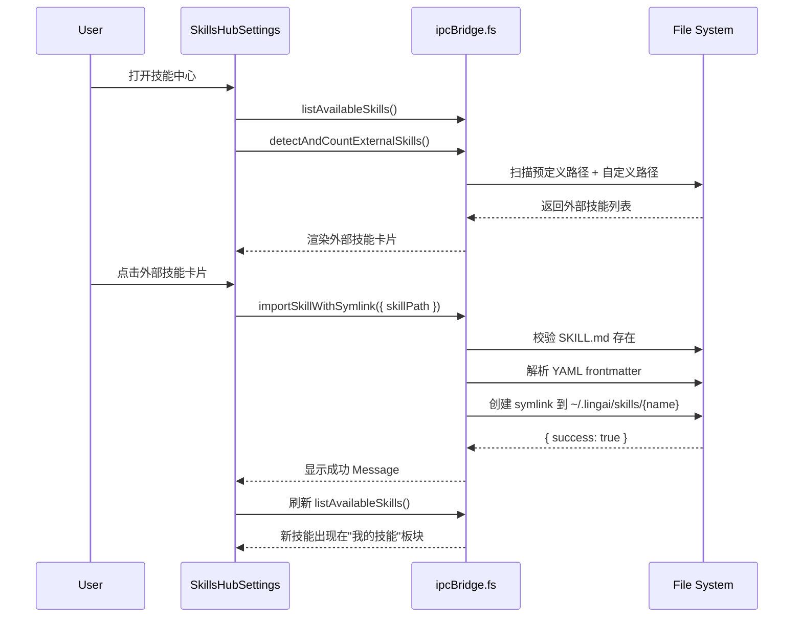
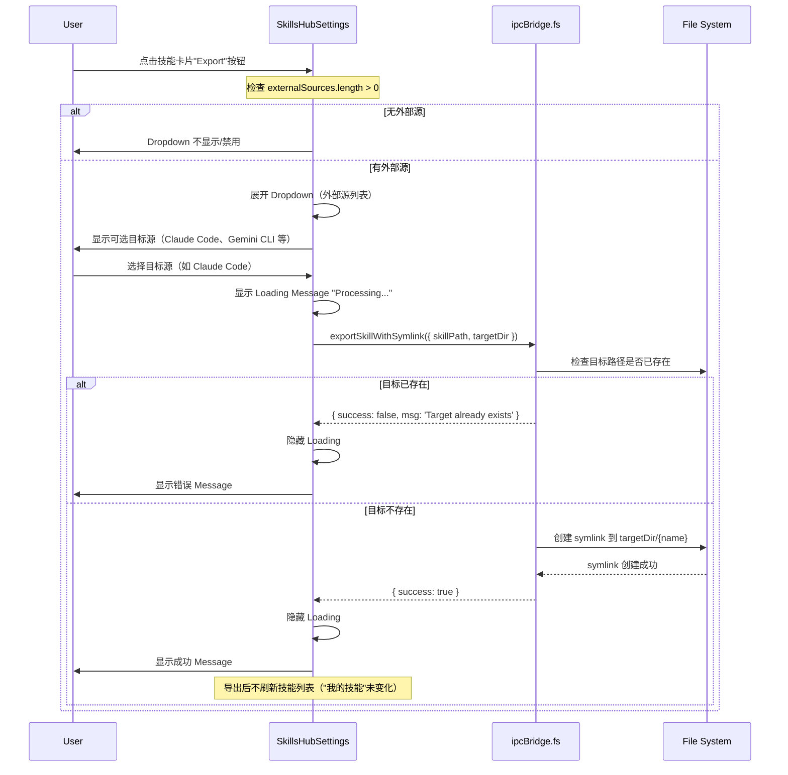
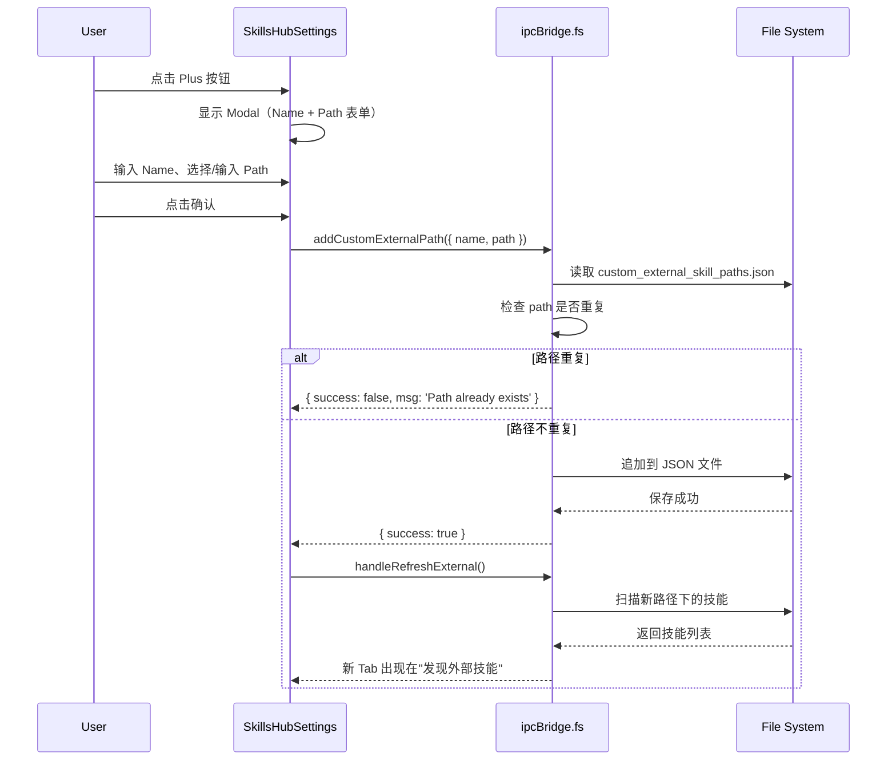

# SkillsHubSettings 功能需求文档

## 1. 页面概述与目的

**页面路径**：`src/renderer/pages/settings/SkillsHubSettings.tsx`

**核心定位**：SkillsHub（技能中心）是 LingAI 的统一技能管理平台，提供一站式的技能导入、导出、删除、搜索与分类展示功能。用户通过该页面集中管理 AI agent 所需的所有技能，实现"一次安装，全助手通用"。

**支持模式**：

- 嵌入模式（`withWrapper=false`）：可嵌入到 Tab 页中，不渲染外层 `SettingsPageWrapper`
- 独立模式（`withWrapper=true`，默认）：作为完整设置页面展示

**技能来源分类**：

1. **Built-in Skills**（内置技能）：位于 `builtin-skills/` 目录
2. **Custom Skills**（自定义技能）：位于用户目录 `~/.lingai/skills/`
3. **Extension Skills**（扩展技能）：由 ExtensionRegistry 贡献
4. **Auto-injected Skills**（自动注入技能）：位于 `_builtin/` 目录，无需用户选择

---

## 2. 功能清单

### 2.1 技能列表展示

#### 2.1.1 我的技能（My Skills）

**源码位置**：`SkillsHubSettings.tsx:392-592`

**功能描述**：

- 展示用户已导入的 builtin 和 custom 技能
- 每项技能卡片包含：
  - 头像（首字母大写，根据名称 hash 取色）：`SkillsHubSettings.tsx:26-41`
  - 技能名称（`skill.name`）
  - 来源标签（builtin / custom）：`SkillsHubSettings.tsx:471-479`
  - 技能描述（`skill.description`，line-clamp-2）：`SkillsHubSettings.tsx:481-488`
  - 操作按钮区（hover 显示）：导出、删除

**数据来源**：

- Bridge 调用：`ipcBridge.fs.listAvailableSkills.invoke()` → `fsBridge.ts:1036-1139`
- 过滤逻辑：排除 `source === 'extension'`（`SkillsHubSettings.tsx:67`）

**搜索功能**：

- 搜索框位置：`SkillsHubSettings.tsx:415-426`
- 搜索范围：技能名称、描述（不区分大小写）
- 实现：`filteredSkills` computed（`SkillsHubSettings.tsx:70-77`）

**刷新功能**：

- 刷新按钮：`SkillsHubSettings.tsx:402-411`
- 触发 `fetchData()`，重新拉取所有技能列表

**自动刷新时机**（所有触发 `fetchData()` 的场景）：

1. **组件挂载**：`useEffect(() => { void fetchData(); }, [fetchData])`（`SkillsHubSettings.tsx:106-108`）
2. **手动点击刷新按钮**：`SkillsHubSettings.tsx:404-407`
3. **导入成功后**：`handleImport` 成功后调用 `void fetchData()`（`SkillsHubSettings.tsx:135`）
4. **删除成功后**：`handleDelete` 成功后调用 `void fetchData()`（`SkillsHubSettings.tsx:171`）
5. **批量导入成功后**：`handleImportAll` 有成功项时调用 `void fetchData()`（`SkillsHubSettings.tsx:162`）
6. **添加自定义路径后**：通过 `handleRefreshExternal()` 间接刷新外部技能（`SkillsHubSettings.tsx:223`）

**不刷新的场景**：

- **导出成功后**：不调用 `fetchData()`，因为"我的技能"列表未变化（仅外部 CLI 目录新增 symlink）

**空状态提示**：

- 无技能时显示：`locales/en-US/settings.json:11` "No skills found. Import some to get started."

**搜索空结果行为**：

- 源码逻辑：`SkillsHubSettings.tsx:450-591`
- 当 `filteredSkills.length === 0` 时进入 else 分支，显示"No skills found"提示（`SkillsHubSettings.tsx:584-590`）
- **场景区分**：
  1. 无技能 + 空搜索：显示"No skills found. Import some to get started."
  2. 有技能 + 搜索无匹配：**同样显示**"No skills found. Import some to get started."（无法区分）
- **注意**：当前实现无法区分"无技能"和"搜索无匹配"场景，用户体验可能不佳

**testid 可用性**：❌ 缺失

- **测试依赖项（P0 优先级）**：需添加以下 data-testid：
  - 板块容器：`my-skills-section`
  - 技能卡片：`my-skill-card-${normalizedName}`（需转义，见 7.2.1）
  - 删除按钮：`delete-skill-button-${normalizedName}`
- **测试依赖项（P1 优先级）**：
  - 搜索框：`my-skills-search-input`
  - 刷新按钮：`my-skills-refresh-button`
  - 手动导入按钮：`manual-import-button`
- **测试依赖项（P2 优先级）**：
  - 导出按钮：`export-skill-button-${normalizedName}`
  - 导出下拉菜单：`export-dropdown-${normalizedName}`

---

#### 2.1.2 发现外部技能（Discovered External Skills）

**源码位置**：`SkillsHubSettings.tsx:248-389`

**功能描述**：

- 自动扫描常见 CLI 工具（Claude Code、Gemini CLI、OpenCode 等）的技能目录
- 多 Tab 切换展示不同来源的技能
- 支持搜索、批量导入、单项导入

**扫描来源**（`fsBridge.ts:1486-1627`）：

- `~/.agents/skills` (Global Agents)
- `~/.gemini/skills` (Gemini CLI)
- `~/.claude/skills` (Claude Code)
- `~/.config/opencode/skills` (OpenCode)
- `~/.opencode/skills` (OpenCode Alt)
- 自定义路径（通过 `custom_external_skill_paths.json` 持久化）

**Tab 切换**：

- Tab 按钮：`SkillsHubSettings.tsx:293-309`
- 状态：`activeSourceTab` → `setActiveSourceTab`
- 显示当前源的技能数量标记

**添加自定义路径**：

- 触发按钮：`SkillsHubSettings.tsx:311-318`（Plus 按钮）
- Modal 表单：`SkillsHubSettings.tsx:699-759`
- Bridge 调用：`ipcBridge.fs.addCustomExternalPath.invoke({ name, path })`
- 实现：`fsBridge.ts:1455-1470`

**批量导入**：

- 按钮位置：`SkillsHubSettings.tsx:330-335`
- 逻辑：`handleImportAll(activeSource.skills)` → `SkillsHubSettings.tsx:145-164`
- 每个技能逐个调用 `importSkillWithSymlink`，成功后累计计数

**单项导入**：

- 点击卡片或 Import 按钮触发
- 调用：`ipcBridge.fs.importSkillWithSymlink.invoke({ skillPath })`
- 实现：`fsBridge.ts:1629-1676`（创建 symlink）

**刷新外部技能**：

- 刷新按钮：`SkillsHubSettings.tsx:261-267`
- 触发 `handleRefreshExternal()` → `SkillsHubSettings.tsx:194-210`
- 重新调用 `ipcBridge.fs.detectAndCountExternalSkills.invoke()`

**搜索功能**：

- 搜索框：`SkillsHubSettings.tsx:277-288`
- 状态：`searchExternalQuery`
- 过滤逻辑：`filteredExternalSkills`（`SkillsHubSettings.tsx:235-243`）

**技能包支持**（Skill Pack）：

- 识别两类结构：
  1. 直接技能：目录下直接包含 `SKILL.md`
  2. 嵌套技能包：目录下有 `skills/` 子目录，每个子目录是独立技能
- 实现：`fsBridge.ts:1551-1600`

**testid 可用性**：❌ 缺失

- **测试依赖项（P0 优先级）**：
  - 板块容器：`external-skills-section`
  - 外部技能卡片：`external-skill-card-${normalizedName}`（需转义，见 7.2.1）
  - 单项导入按钮：`import-skill-button-${normalizedName}`
  - 批量导入按钮：`import-all-skills-button`
- **测试依赖项（P1 优先级）**：
  - 搜索框：`external-skills-search-input`
  - 刷新按钮：`external-skills-refresh-button`
  - 添加路径按钮：`add-custom-path-button`
  - 添加路径 Modal：`add-custom-path-modal`
- **测试依赖项（P2 优先级）**：
  - Tab 按钮：`external-source-tab-${source.source}`

---

#### 2.1.3 扩展技能（Extension Skills）

**源码位置**：`SkillsHubSettings.tsx:594-635`

**功能描述**：

- 展示由 Extension 插件贡献的技能（`source === 'extension'`）
- 只读展示，不支持删除或导出
- 卡片样式：紫色 Puzzle 图标 + Extension 标签

**数据来源**：

- 从 `listAvailableSkills` 返回的数据中过滤 `source === 'extension'`
- Extension 注册逻辑：`fsBridge.ts:1103-1118`（调用 `ExtensionRegistry.getInstance().getSkills()`）

**testid 可用性**：❌ 缺失

- **测试依赖项**：需添加 `extension-skill-card-${skill.name}`

---

#### 2.1.4 自动注入技能（Auto-injected Skills）

**源码位置**：`SkillsHubSettings.tsx:637-678`

**功能描述**：

- 展示系统自动注入的内置技能（无需用户选择）
- 来源目录：`_builtin/` 子目录
- 卡片样式：绿色 Lightning 图标 + Auto 标签

**数据来源**：

- Bridge 调用：`ipcBridge.fs.listBuiltinAutoSkills.invoke()` → `fsBridge.ts:1142-1181`
- 扫描 `getAutoSkillsDir()` 目录下的所有技能

**testid 可用性**：❌ 缺失

- **测试依赖项**：需添加 `auto-skill-card-${skill.name}`

---

### 2.2 技能导入

#### 2.2.1 从文件夹导入（Manual Import）

**源码位置**：`SkillsHubSettings.tsx:428-436`

**功能描述**：

- 点击 "Import from Folder" 按钮触发文件选择器
- 选择包含 `SKILL.md` 的目录
- 通过 symlink 方式导入到用户目录

**实现流程**：

1. 调用：`ipcBridge.dialog.showOpen.invoke({ properties: ['openDirectory', 'createDirectory'] })`（`SkillsHubSettings.tsx:183-186`）
2. 获得路径后调用：`handleImport(skillPath)` → `SkillsHubSettings.tsx:128-143`
3. Bridge 调用：`ipcBridge.fs.importSkillWithSymlink.invoke({ skillPath })`
4. 实现：`fsBridge.ts:1629-1676`
   - 校验 `SKILL.md` 存在
   - 解析 YAML frontmatter 获取技能名称
   - 创建 symlink：`fs.symlink(skillPath, targetDir, 'junction')`
   - 目标路径：`~/.lingai/skills/{skillName}`

**边界处理**：

- 目录中无 `SKILL.md`：返回 `{ success: false, msg: 'SKILL.md file not found' }`
- 技能已存在：返回 `{ success: false, msg: 'Skill already exists' }`

**testid 可用性**：❌ 缺失

- **测试依赖项**：需添加 `manual-import-button`

---

#### 2.2.2 符号链接导入（Symlink Import）

**源码位置**：`fsBridge.ts:1629-1676`

**功能描述**：

- 采用符号链接（junction on Windows）而非文件复制
- 优点：节省空间，修改源文件立即生效
- 适用场景：导入外部 CLI 技能或用户自定义路径

**实现细节**：

- Windows：`fs.symlink(src, dest, 'junction')`
- macOS/Linux：`fs.symlink(src, dest, 'dir')`
- 目标目录不存在时自动创建：`fs.mkdir(userSkillsDir, { recursive: true })`

**testid 可用性**：N/A（后端逻辑）

---

#### 2.2.3 批量导入（Import All）

**源码位置**：`SkillsHubSettings.tsx:145-164`

**功能描述**：

- 从某个外部源一次性导入所有技能
- 失败不中断，继续尝试后续技能
- 显示成功导入数量

**实现逻辑**：

```typescript
for (const skill of skills) {
  try {
    const result = await ipcBridge.fs.importSkillWithSymlink.invoke({ skillPath: skill.path });
    if (result.success) successCount++;
  } catch {
    // continue
  }
}
```

**UI 状态说明**：

- **加载状态**：❌ 无（导入过程中按钮不禁用，无 loading 指示）
- **进度反馈**：❌ 无（无法查看当前导入进度）
- **取消机制**：❌ 无（无法中途取消批量导入）
- **失败处理**：单个技能失败不中断，继续导入后续技能
- **成功提示**：仅显示总成功数量（`importAllSuccess: "{{count}} skills imported"`）

**性能影响**：

- 导入 10+ 技能时可能阻塞 UI 响应（无 loading 状态）
- 建议测试：批量导入 20 个技能时的 UI 流畅度

**testid 可用性**：❌ 缺失

- **测试依赖项**：已在 2.1.2 列出

---

### 2.3 技能导出

#### 2.3.1 导出到外部源（Export to External Source）

**源码位置**：`SkillsHubSettings.tsx:492-558`

**功能描述**：

- 将"我的技能"中的技能导出（下发）到外部 CLI 工具的技能目录
- 仅支持 custom 或 builtin 技能（不支持 extension）
- 通过 Dropdown 菜单选择目标源

**实现流程**：

1. 点击技能卡片上的 "Export" 按钮（`SkillsHubSettings.tsx:550-558`）
2. Dropdown 展示所有已检测到的外部源（`SkillsHubSettings.tsx:493-559`）
3. 选择目标源后调用：
   ```typescript
   const skillPath = skill.location.replace(/[\\/]SKILL\.md$/, '');
   await ipcBridge.fs.exportSkillWithSymlink.invoke({ skillPath, targetDir: source.path });
   ```
4. Bridge 实现：`fsBridge.ts:1724-1755`
   - 检查目标路径是否已存在
   - 创建 symlink：`fs.symlink(skillPath, targetPath, 'junction')`

**超时保护**：

- 8 秒超时限制（`SkillsHubSettings.tsx:511-519`）
- 超时后显示错误信息

**边界处理**：

- 目标已存在：`{ success: false, msg: 'Target already exists' }`
- 无可导出源：Dropdown 不显示

**testid 可用性**：❌ 缺失

- **测试依赖项**：需添加 `export-skill-button-${skill.name}`、`export-dropdown-${skill.name}`

---

### 2.4 技能删除

#### 2.4.1 删除自定义技能（Delete Custom Skill）

**源码位置**：`SkillsHubSettings.tsx:560-579`

**功能描述**：

- 仅 custom 技能可删除（builtin、extension、auto 不可删除）
- 删除前弹出确认对话框
- 支持删除 symlink 或实际目录

**实现流程**：

1. 点击删除按钮（`SkillsHubSettings.tsx:561-578`）
2. Modal 确认：`Modal.confirm()` → `locales/settings.json:24-25`
3. Bridge 调用：`ipcBridge.fs.deleteSkill.invoke({ skillName })`
4. 实现：`fsBridge.ts:1679-1715`
   - 安全性检查：确保路径在 `userSkillsDir` 范围内
   - 判断是否 symlink：`fs.lstat(resolvedSkillDir)`
   - symlink：`fs.unlink()`
   - 实际目录：`fs.rm({ recursive: true, force: true })`

**安全边界**：

- 路径穿越防护：`resolvedSkillDir.startsWith(resolvedSkillsDir + path.sep)`（`fsBridge.ts:1686-1691`）
- 技能不存在：返回 `{ success: false, msg: 'Skill not found' }`

**testid 可用性**：❌ 缺失

- **测试依赖项**：已在 2.1.1 列出（P0 优先级）

---

#### 2.7.3 删除自定义外部路径

**源码位置**：`fsBridge.ts:1472-1483` (Bridge 实现)

**功能描述**：

- Bridge 层已实现删除自定义外部路径的功能
- **当前状态**：❌ **UI 层未实现**（前端未调用 `removeCustomExternalPath`）

**Bridge 实现**：

```typescript
ipcBridge.fs.removeCustomExternalPath.provider(async ({ path: skillPath }) => {
  try {
    const existing = await loadCustomExternalPaths();
    const filtered = existing.filter((p) => p.path !== skillPath);
    await saveCustomExternalPaths(filtered);
    return { success: true, msg: 'Custom path removed' };
  } catch (error) {
    return { success: false, msg: 'Failed to remove path' };
  }
});
```

**影响**：

- 用户添加错误路径后无法通过 UI 删除
- 必须手动编辑 `~/.lingai/custom_external_skill_paths.json` 文件

**建议**：

- 后续版本在 Tab 按钮上添加删除图标或右键菜单
- E2E 测试范围：**不包含**此功能（UI 未实现）

**testid 可用性**：N/A（功能未实现）

---

### 2.5 技能搜索与筛选

#### 2.5.1 我的技能搜索

**源码位置**：`SkillsHubSettings.tsx:415-426` / `SkillsHubSettings.tsx:70-77`

**功能描述**：

- 实时搜索技能名称和描述
- 不区分大小写
- 空查询时显示全部

**实现逻辑**：

```typescript
const filteredSkills = useMemo(() => {
  if (!searchQuery.trim()) return mySkills;
  const lowerQuery = searchQuery.toLowerCase();
  return mySkills.filter(
    (s) =>
      s.name.toLowerCase().includes(lowerQuery) || (s.description && s.description.toLowerCase().includes(lowerQuery))
  );
}, [mySkills, searchQuery]);
```

**空结果提示**：无单独空结果提示（直接不显示卡片）

**testid 可用性**：❌ 缺失

- **测试依赖项**：已在 2.1.1 列出

---

#### 2.5.2 外部技能搜索

**源码位置**：`SkillsHubSettings.tsx:277-288` / `SkillsHubSettings.tsx:235-243`

**功能描述**：

- 仅搜索当前选中 Tab 的技能
- 搜索逻辑同 2.5.1

**空结果提示**：

- 显示：`locales/settings.json:39` "No matching skills found"
- UI：`SkillsHubSettings.tsx:380-384`（虚线边框空状态卡）

**testid 可用性**：❌ 缺失

- **测试依赖项**：已在 2.1.2 列出

---

### 2.6 技能扫描与检测

#### 2.6.1 常见路径扫描

**源码位置**：`fsBridge.ts:1388-1430` (detectCommonSkillPaths)

**功能描述**：

- 扫描预定义的常见 CLI 技能目录
- 返回存在的路径列表

**扫描列表**：

```typescript
[
  { name: 'Global Agents', path: '~/.agents/skills' },
  { name: 'Gemini CLI', path: '~/.gemini/skills' },
  { name: 'Claude Code', path: '~/.claude/skills' },
  { name: 'OpenCode', path: '~/.config/opencode/skills' },
  { name: 'OpenCode (Alt)', path: '~/.opencode/skills' },
];
```

**testid 可用性**：N/A（后端逻辑）

---

#### 2.6.2 目录深度扫描

**源码位置**：`fsBridge.ts:1309-1385` (scanForSkills)

**功能描述**：

- 扫描用户指定目录，查找所有 `SKILL.md` 文件
- 支持两级扫描：
  1. 当前目录下的直接子目录
  2. 当前目录本身是否包含 `SKILL.md`

**YAML 解析**：

- 解析 frontmatter 提取 `name` 和 `description`
- 正则：`/^---\s*\n([\s\S]*?)\n---/`

**testid 可用性**：N/A（后端逻辑）

---

### 2.7 技能路径管理

#### 2.7.1 添加自定义外部路径

**源码位置**：`SkillsHubSettings.tsx:699-759` (Modal) / `fsBridge.ts:1455-1470`

**功能描述**：

- 用户手动添加不在预定义列表中的技能目录
- 支持文件选择器或手动输入
- 持久化到 `custom_external_skill_paths.json`

**表单字段**：

- Name（路径别名）：必填，`locales/settings.json:35`
- Path（目录路径）：必填，`locales/settings.json:36-37`

**实现流程**：

1. Modal 表单输入
2. Bridge 调用：`ipcBridge.fs.addCustomExternalPath.invoke({ name, path })`
3. 读取现有配置：`loadCustomExternalPaths()`（`fsBridge.ts:1436-1443`）
4. 去重检查：`existing.some(p => p.path === skillPath)`
5. 追加新路径并保存：`saveCustomExternalPaths()`（`fsBridge.ts:1446-1449`）
6. 刷新外部技能列表

**文件选择器集成**：

- 点击 FolderOpen 图标触发（`SkillsHubSettings.tsx:739-756`）
- 自动填充 Path 字段

**testid 可用性**：❌ 缺失

- **测试依赖项**：需添加以下 data-testid：
  - Modal：`add-custom-path-modal`
  - Name 输入：`custom-path-name-input`
  - Path 输入：`custom-path-value-input`
  - 浏览按钮：`custom-path-browse-button`
  - 确认按钮：Modal 默认 ok button

---

#### 2.7.2 获取技能存储路径

**源码位置**：`fsBridge.ts:1718-1721` (getSkillPaths)

**功能描述**：

- 获取用户技能目录和内置技能目录路径
- 用于前端展示目录位置

**返回值**：

```typescript
{
  userSkillsDir: string; // ~/.lingai/skills
  builtinSkillsDir: string; // builtin-skills/
}
```

**testid 可用性**：N/A（后端逻辑）

---

### 2.8 技能高亮与滚动定位

#### 2.8.1 URL 参数触发高亮

**源码位置**：`SkillsHubSettings.tsx:110-126`

**功能描述**：

- 通过 URL 参数 `?highlight=skillName` 跳转并高亮指定技能
- 自动滚动到目标技能卡片
- 2 秒后取消高亮

**实现逻辑**：

```typescript
useEffect(() => {
  if (!highlightName || loading) return;
  const el = skillRefs.current[highlightName];
  if (el) {
    requestAnimationFrame(() => {
      el.scrollIntoView({ behavior: 'smooth', block: 'center' });
      setHighlightedSkill(highlightName);
      const timer = setTimeout(() => setHighlightedSkill(null), 2000);
      setSearchParams({}, { replace: true });
      return () => clearTimeout(timer);
    });
  }
}, [highlightName, loading, availableSkills, setSearchParams]);
```

**高亮样式**：

- 边框：`border-primary-5`
- 背景：`bg-primary-1`
- 应用位置：技能卡片的 className 条件判断

**清理 URL**：

- 滚动完成后调用 `setSearchParams({}, { replace: true })` 清除参数

**testid 可用性**：✅ 可通过 URL + ref 定位

---

### 2.9 国际化支持

#### 2.9.1 i18n 文本覆盖范围

**源码文件**：`src/renderer/services/i18n/locales/*/settings.json`（key: `skillsHub`）

**完整 i18n key 映射表**：

| key                         | 用途                   | 示例值 (en-US)                                           |
| --------------------------- | ---------------------- | -------------------------------------------------------- |
| `title`                     | 页面标题               | "Skills Hub"                                             |
| `description`               | 页面描述               | "Centrally manage AI agent skills..."                    |
| `mySkillsTitle`             | 我的技能板块标题       | "My Skills"                                              |
| `discoveredTitle`           | 外部技能板块标题       | "Discovered External Skills"                             |
| `discoveryAlert`            | 外部技能提示           | "Detected skills from your CLI tools..."                 |
| `noSkills`                  | 空状态提示             | "No skills found. Import some to get started."           |
| `custom`                    | 自定义技能标签         | "Custom"                                                 |
| `builtin`                   | 内置技能标签           | "Built-in"                                               |
| `tipTitle`                  | 使用提示标题           | "Usage Tip:"                                             |
| `tipContent`                | 使用提示内容           | "Skills configured here can be enabled..."               |
| `manualImport`              | 手动导入按钮           | "Import from Folder"                                     |
| `importAll`                 | 批量导入按钮           | "Import All"                                             |
| `importSuccess`             | 导入成功提示           | "Skill imported successfully"                            |
| `importFailed`              | 导入失败提示           | "Failed to import skill"                                 |
| `importError`               | 导入异常提示           | "Error importing skill"                                  |
| `importAllSuccess`          | 批量导入成功（带计数） | "{{count}} skills imported"                              |
| `exportTo`                  | 导出按钮               | "Export To..."                                           |
| `exportSuccess`             | 导出成功提示           | "Skill exported successfully"                            |
| `exportFailed`              | 导出失败提示           | "Failed to export skill"                                 |
| `exportAlreadyExists`       | 导出目标已存在         | "Skill already exists in the target directory"           |
| `deleteSuccess`             | 删除成功提示           | "Skill deleted"                                          |
| `deleteFailed`              | 删除失败提示           | "Failed to delete skill"                                 |
| `deleteError`               | 删除异常提示           | "Error deleting skill"                                   |
| `deleteConfirmTitle`        | 删除确认 Modal 标题    | "Delete Skill"                                           |
| `deleteConfirmContent`      | 删除确认内容（带插值） | "Are you sure you want to delete \"{{name}}\"?"          |
| `fetchError`                | 获取技能列表失败       | "Failed to fetch skills"                                 |
| `searchPlaceholder`         | 搜索框占位符           | "Search skills..."                                       |
| `noSearchResults`           | 搜索无结果提示         | "No matching skills found"                               |
| `addCustomPath`             | 添加自定义路径按钮     | "Add Custom Skill Path"                                  |
| `customPathNamePlaceholder` | 自定义路径名称占位符   | "e.g. My Custom Skills"                                  |
| `customPathLabel`           | 自定义路径输入框标签   | "Skill Directory Path"                                   |
| `customPathPlaceholder`     | 自定义路径输入框占位符 | "e.g. C:\\Users\\me\\.mytools\\skills"                   |
| `manageInHub`               | 跳转技能中心链接       | "Manage in Skills Hub"                                   |
| `recommend`                 | 推荐技能按钮           | "Recommend Skills"                                       |
| `recommendSuccess`          | 推荐成功提示           | "Recommended successfully: {{count}} skills selected..." |
| `noRecommendations`         | 无推荐结果             | "No matching skills found, please select manually"       |

**语言支持**：

- 英文（en-US）：`src/renderer/services/i18n/locales/en-US/settings.json:3-40`
- 中文（zh-CN）：`src/renderer/services/i18n/locales/zh-CN/settings.json:3-40`
- 其他语言：tr-TR, uk-UA, ru-RU, ko-KR, ja-JP, zh-TW

**E2E 测试使用**：

- 错误提示验证：所有错误场景下的 Message 文本需验证 i18n key 正确性
- 插值验证：`deleteConfirmContent`、`importAllSuccess`、`recommendSuccess` 需验证动态参数替换

**testid 可用性**：✅ i18n key 稳定

---

### 2.10 主题与样式

#### 2.10.1 色彩系统

**源码位置**：`SkillsHubSettings.tsx:26-41` (getAvatarColorClass)

**功能描述**：

- 根据技能名称 hash 计算头像背景色
- 6 种预定义颜色循环使用

**颜色列表**：

```typescript
[
  'bg-[#165DFF] text-white', // Blue
  'bg-[#00B42A] text-white', // Green
  'bg-[#722ED1] text-white', // Purple
  'bg-[#F5319D] text-white', // Pink
  'bg-[#F77234] text-white', // Orange
  'bg-[#14C9C9] text-white', // Cyan
];
```

**testid 可用性**：✅ 可通过 class 验证

---

#### 2.10.2 响应式设计

**断点使用**：

- `md:` 断点：用于 padding、字体大小、布局切换
- `sm:` 断点：用于 flexbox 方向、按钮显示方式
- `lg:` 断点：用于工具栏布局

**典型场景**：

- 搜索框：`sm:w-[200px] lg:w-[240px]`（`SkillsHubSettings.tsx:415`）
- 卡片内容：`flex-col sm:flex-row`（移动端竖向，桌面端横向）
- 按钮 opacity：`opacity-100 sm:opacity-0 group-hover:opacity-100`（移动端始终显示，桌面端 hover 显示）

**testid 可用性**：✅ 可通过 viewport 变化验证

---

## 3. 交互流程

### 3.1 完整导入流程（外部技能 → 我的技能）



---

### 3.2 技能导出流程（我的技能 → 外部 CLI）



**关键步骤说明**：

- **Dropdown 显示条件**：`externalSources.length > 0`（`SkillsHubSettings.tsx:492`）
- **Loading 状态**：8 秒超时（`SkillsHubSettings.tsx:504-519`）
- **刷新逻辑**：导出成功后**不刷新**技能列表（因为"我的技能"未变化，仅外部 CLI 目录新增文件）

---

### 3.3 添加自定义外部路径流程



---

## 4. 数据模型与持久化

### 4.1 Skill 数据结构

#### 4.1.1 前端数据结构（SkillInfo）

**源码位置**：`SkillsHubSettings.tsx:10-16`

```typescript
interface SkillInfo {
  name: string; // 技能名称
  description: string; // 技能描述
  location: string; // SKILL.md 文件绝对路径
  isCustom: boolean; // 是否自定义技能
  source?: 'builtin' | 'custom' | 'extension'; // 技能来源
}
```

---

#### 4.1.2 外部源数据结构（ExternalSource）

**源码位置**：`SkillsHubSettings.tsx:18-24`

```typescript
interface ExternalSource {
  name: string; // 源名称（如 "Claude Code"）
  path: string; // 源路径（如 "~/.claude/skills"）
  source: string; // 源标识（如 "claude"）
  skills: Array<{
    // 该源下的技能列表
    name: string;
    description: string;
    path: string; // 技能目录路径
  }>;
}
```

---

### 4.2 持久化机制

#### 4.2.1 技能目录结构

**位置**：`~/.lingai/`（`src/process/utils/initStorage.ts`）

```
~/.lingai/
├── skills/                    # 用户技能目录
│   ├── my-skill/              # 自定义技能（可能是 symlink）
│   │   └── SKILL.md
│   └── imported-skill/        # 导入的外部技能（symlink）
│       └── SKILL.md
├── builtin-skills/            # 内置技能副本
│   ├── skill-a/
│   │   └── SKILL.md
│   └── _builtin/              # 自动注入技能（不展示在列表）
│       └── lingai-skills/
│           └── SKILL.md
└── custom_external_skill_paths.json # 自定义外部路径配置
```

---

#### 4.2.2 自定义路径配置文件

**文件路径**：`~/.lingai/custom_external_skill_paths.json`

**结构**：

```json
[
  { "name": "My Custom Skills", "path": "/path/to/skills" },
  { "name": "Team Skills", "path": "/shared/skills" }
]
```

**读写函数**：

- 读取：`loadCustomExternalPaths()` → `fsBridge.ts:1436-1443`
- 保存：`saveCustomExternalPaths()` → `fsBridge.ts:1446-1449`
- 获取：`ipcBridge.fs.getCustomExternalPaths.invoke()` → `fsBridge.ts:1451-1453`

---

#### 4.2.3 SKILL.md 格式规范

**源码解析位置**：`fsBridge.ts:1064-1079`

**格式**：

```markdown
---
name: my-skill
description: 'This skill does something amazing'
---

# Skill Documentation

...
```

**解析正则**：

```typescript
const frontMatterMatch = content.match(/^---\s*\n([\s\S]*?)\n---/);
const yaml = frontMatterMatch[1];
const nameMatch = yaml.match(/^name:\s*(.+)$/m);
const descMatch = yaml.match(/^description:\s*['"]?(.+?)['"]?$/m);
```

---

### 4.3 状态管理

#### 4.3.1 核心状态变量

**源码位置**：`SkillsHubSettings.tsx:54-65`

```typescript
const [loading, setLoading] = useState(false);                    // 加载状态
const [availableSkills, setAvailableSkills] = useState<SkillInfo[]>([]);   // 所有技能
const [skillPaths, setSkillPaths] = useState<{ ... } | null>(null);        // 技能路径
const [externalSources, setExternalSources] = useState<ExternalSource[]>([]);  // 外部源
const [activeSourceTab, setActiveSourceTab] = useState<string>('');        // 当前选中源
const [searchQuery, setSearchQuery] = useState('');                        // 我的技能搜索
const [searchExternalQuery, setSearchExternalQuery] = useState('');        // 外部技能搜索
const [showAddPathModal, setShowAddPathModal] = useState(false);           // 自定义路径Modal
const [customPathName, setCustomPathName] = useState('');                  // 自定义路径名称
const [customPathValue, setCustomPathValue] = useState('');                // 自定义路径值
const [refreshing, setRefreshing] = useState(false);                       // 刷新状态
const [builtinAutoSkills, setBuiltinAutoSkills] = useState<Array<...>>([]);  // 自动注入技能
```

---

#### 4.3.2 计算状态（Computed State）

**源码位置**：`SkillsHubSettings.tsx:67-77`

```typescript
// 我的技能（排除扩展技能）
const mySkills = useMemo(() => availableSkills.filter((s) => s.source !== 'extension'), [availableSkills]);

// 扩展技能
const extensionSkills = useMemo(() => availableSkills.filter((s) => s.source === 'extension'), [availableSkills]);

// 过滤后的我的技能
const filteredSkills = useMemo(() => {
  if (!searchQuery.trim()) return mySkills;
  const lowerQuery = searchQuery.toLowerCase();
  return mySkills.filter(
    (s) =>
      s.name.toLowerCase().includes(lowerQuery) || (s.description && s.description.toLowerCase().includes(lowerQuery))
  );
}, [mySkills, searchQuery]);
```

---

## 5. 边界与异常处理

### 5.1 文件系统异常

#### 5.1.1 技能目录不存在

**处理位置**：`fsBridge.ts:1050`

**行为**：

- `fs.access(skillsDir)` 失败时跳过该目录
- 不抛出错误，返回空数组
- 前端显示"未发现技能"

---

#### 5.1.2 SKILL.md 缺失

**处理位置**：`fsBridge.ts:1236-1244`（importSkill）

**行为**：

- 返回 `{ success: false, msg: 'SKILL.md file not found in the selected directory' }`
- 前端显示 i18n 错误提示：`settings.json:19-20`

---

#### 5.1.3 YAML 解析失败

**处理位置**：`fsBridge.ts:1064-1079`

**行为**：

- frontmatter 不匹配时跳过该技能
- 不中断扫描流程
- 使用目录名作为 fallback name

---

#### 5.1.4 技能名称特殊字符处理

**处理位置**：`fsBridge.ts:1646-1648` (YAML 解析)

**当前实现**：

- YAML 解析后直接 `trim()`，**无特殊字符过滤**
- 依赖文件系统在 symlink 创建时报错

**潜在风险**：

- 技能名称包含 `/`, `\`, `:`, `<`, `>`, `"`, `|`, `?`, `*` 等文件系统禁用字符
- Symlink 创建可能失败：`fs.symlink(src, dest)` 抛出 ENOENT 或 EINVAL
- 前端 `data-testid` 中的 `${skill.name}` 可能包含特殊字符导致选择器失效

**对比其他场景**：

- 文件上传场景有过滤：`fsBridge.ts:467` 和 `fsBridge.ts:535`
  ```typescript
  const safeFileName = fileName.replace(/[<>:"/\\|?*]/g, '_');
  ```
- **技能名称场景无过滤**

**建议**：

- E2E 测试需覆盖：导入名称为 `my:skill` 或 `my/skill` 的技能时的行为
- 预期行为：symlink 创建失败，显示错误提示

---

### 5.2 权限与安全

#### 5.2.1 路径穿越防护

**处理位置**：`fsBridge.ts:1686-1691`（deleteSkill）

**实现**：

```typescript
const resolvedSkillDir = path.resolve(skillDir);
const resolvedSkillsDir = path.resolve(userSkillsDir);
if (!resolvedSkillDir.startsWith(resolvedSkillsDir + path.sep)) {
  return { success: false, msg: 'Invalid skill path (security check failed)' };
}
```

**防护范围**：

- 删除技能
- 写入文件
- 所有涉及用户输入路径的操作

---

#### 5.2.2 Symlink 环形引用检测

**处理位置**：`fsBridge.ts:1548`（detectAndCountExternalSkills）

**行为**：

- 仅检查 `entry.isDirectory()` 和 `entry.isSymbolicLink()`
- 不跟踪 symlink 目标，避免无限循环
- 扫描时遇到 symlink 视为普通目录处理

---

### 5.3 网络与超时

#### 5.3.1 导出超时

**处理位置**：`SkillsHubSettings.tsx:511-519`

**实现**：

```typescript
const result = await Promise.race([
  ipcBridge.fs.exportSkillWithSymlink.invoke({ skillPath, targetDir }),
  new Promise<{ success: boolean; msg: string }>((_, reject) =>
    setTimeout(() => reject(new Error('Export timed out.')), 8000)
  ),
]);
```

**超时阈值**：8 秒
**超时行为**：显示错误 Message

---

### 5.4 并发与竞态

#### 5.4.1 连续快速刷新

**处理位置**：`SkillsHubSettings.tsx:194-210`（handleRefreshExternal）

**行为**：

- `refreshing` 状态阻止重复调用（按钮禁用）
- 无防抖处理，但按钮动画提供视觉反馈

---

#### 5.4.2 批量导入冲突

**处理位置**：`SkillsHubSettings.tsx:145-164`（handleImportAll）

**行为**：

- 顺序导入，非并发
- 每个技能独立 try-catch
- 失败不中断后续导入

---

### 5.5 性能与规模限制

#### 5.5.1 大规模技能列表渲染

**源码位置**：`SkillsHubSettings.tsx:338-386` (外部技能列表)

**当前实现**：

- 无虚拟滚动
- 无分页
- 所有技能卡片一次性渲染

**性能边界**：

- 外部源包含 100+ 技能时可能出现渲染卡顿
- "我的技能"板块 50+ 技能时滚动可能不流畅
- 最大高度限制：`max-h-[360px]`（外部技能区域）

**搜索性能**：

- 无防抖：`onChange` 直接更新 `searchQuery` 状态
- 快速输入可能频繁触发 `useMemo` 重新计算

**建议**：

- 建议单个板块技能数量 ≤ 100 个
- E2E 测试需验证：
  1. 50 个技能时的渲染时间 < 1 秒
  2. 搜索输入响应延迟 < 100ms
  3. Tab 切换流畅度

---

#### 5.5.2 批量导入阻塞 UI

**源码位置**：`SkillsHubSettings.tsx:145-164`

**问题**：

- 批量导入 20+ 技能时可能阻塞主线程
- 无 `async/await` 并发优化
- 无进度指示

**影响**：

- 用户无法进行其他操作
- 页面可能出现"假死"现象

**建议**：

- E2E 测试需验证：批量导入 10 个技能时 UI 仍可响应

---

## 6. 国际化/主题相关

### 6.1 i18n Key 映射表

| 功能场景     | i18n Key                                  | 中文示例                   | 英文示例                                     | 源码位置      |
| ------------ | ----------------------------------------- | -------------------------- | -------------------------------------------- | ------------- |
| **页面标题** | `settings.skillsHub.title`                | 技能中心                   | Skills Hub                                   | -             |
| **板块标题** |
| 我的技能     | `settings.skillsHub.mySkillsTitle`        | 我的技能                   | My Skills                                    | line 397      |
| 发现外部技能 | `settings.skillsHub.discoveredTitle`      | 发现外部技能               | Discovered External Skills                   | line 256      |
| **操作按钮** |
| 全部导入     | `settings.skillsHub.importAll`            | 全部导入                   | Import All                                   | line 334      |
| 手动导入     | `settings.skillsHub.manualImport`         | 从文件夹导入               | Import from Folder                           | line 434      |
| 导出到       | `settings.skillsHub.exportTo`             | 下发到...                  | Export To...                                 | line 555      |
| **成功提示** |
| 导入成功     | `settings.skillsHub.importSuccess`        | 技能导入成功               | Skill imported successfully                  | line 133      |
| 批量导入成功 | `settings.skillsHub.importAllSuccess`     | 成功导入 {{count}} 项技能  | {{count}} skills imported                    | line 157-160  |
| 删除成功     | `settings.skillsHub.deleteSuccess`        | 技能已删除                 | Skill deleted                                | line 170      |
| 导出成功     | `settings.skillsHub.exportSuccess`        | 技能下发成功               | Skill exported successfully                  | line 523-526  |
| **错误提示** |
| 获取失败     | `settings.skillsHub.fetchError`           | 获取技能失败               | Failed to fetch skills                       | line 100      |
| 导入失败     | `settings.skillsHub.importFailed`         | 技能导入失败               | Failed to import skill                       | line 137      |
| 导入异常     | `settings.skillsHub.importError`          | 导入技能出错               | Error importing skill                        | line 141      |
| 删除失败     | `settings.skillsHub.deleteFailed`         | 删除技能失败               | Failed to delete skill                       | line 173      |
| 删除异常     | `settings.skillsHub.deleteError`          | 删除技能出错               | Error deleting skill                         | line 177      |
| 导出失败     | `settings.skillsHub.exportFailed`         | 技能下发失败               | Failed to export skill                       | line 529-532  |
| **其他**     |
| 搜索占位符   | `settings.skillsHub.searchPlaceholder`    | 搜索技能...                | Search skills...                             | line 284, 423 |
| 无搜索结果   | `settings.skillsHub.noSearchResults`      | 未找到相关技能             | No matching skills found                     | line 382      |
| 无技能提示   | `settings.skillsHub.noSkills`             | 未发现技能                 | No skills found. Import some to get started. | line 587      |
| 删除确认标题 | `settings.skillsHub.deleteConfirmTitle`   | 删除技能                   | Delete Skill                                 | line 565      |
| 删除确认内容 | `settings.skillsHub.deleteConfirmContent` | 确定要删除 "{{name}}" 吗？ | Are you sure you want to delete "{{name}}"?  | line 566-568  |
| 自定义路径   | `settings.skillsHub.addCustomPath`        | 添加自定义技能路径         | Add Custom Skill Path                        | line 700      |

完整列表见 `locales/*/settings.json:3-40`（共 39 个 key）

---

### 6.2 主题适配

#### 6.2.1 色彩变量使用

**源码位置**：全组件范围

**语义化色彩**：

- `text-t-primary`：主要文本
- `text-t-secondary`：次要文本
- `text-t-tertiary`：辅助文本
- `bg-base`：基础背景
- `bg-fill-1`, `bg-fill-2`：填充背景
- `border-border-1`, `border-b-base`：边框
- `text-primary-6`, `bg-primary-6`：主题色

**硬编码色彩**（仅头像）：

- `SkillsHubSettings.tsx:28-35`：6 种预定义颜色
- 原因：固定色彩保证视觉一致性

---

#### 6.2.2 暗色模式支持

**实现方式**：UnoCSS + CSS 变量

**适配范围**：

- 所有背景、文本、边框均使用 CSS 变量
- 无需额外适配代码
- Arco Design 组件自动跟随主题

---

## 7. data-testid 可用性评估

### 7.1 已有 testid

- **无**（当前代码中未添加任何 data-testid）

---

### 7.2 缺失 testid（测试依赖项）

#### 7.2.1 我的技能板块

- `my-skills-section`：板块容器
- `my-skill-card-${skill.name}`：技能卡片
- `my-skills-search-input`：搜索输入框
- `my-skills-refresh-button`：刷新按钮
- `manual-import-button`：手动导入按钮
- `export-skill-button-${skill.name}`：导出按钮
- `export-dropdown-${skill.name}`：导出下拉菜单
- `delete-skill-button-${skill.name}`：删除按钮

---

#### 7.2.2 发现外部技能板块

- `external-skills-section`：板块容器
- `external-source-tab-${source.source}`：源 Tab 按钮
- `add-custom-path-button`：添加自定义路径按钮
- `external-skills-search-input`：搜索输入框
- `external-skills-refresh-button`：刷新按钮
- `external-skill-card-${skill.name}`：技能卡片
- `import-skill-button-${skill.name}`：单项导入按钮
- `import-all-skills-button`：批量导入按钮

---

#### 7.2.3 扩展技能板块

- `extension-skills-section`：板块容器
- `extension-skill-card-${skill.name}`：技能卡片

---

#### 7.2.4 自动注入技能板块

- `auto-skills-section`：板块容器
- `auto-skill-card-${skill.name}`：技能卡片

---

#### 7.2.5 自定义路径 Modal

- `add-custom-path-modal`：Modal 容器
- `custom-path-name-input`：Name 输入框
- `custom-path-value-input`：Path 输入框
- `custom-path-browse-button`：浏览按钮

---

### 7.3 data-testid 转义规则

#### 7.3.1 动态 testid 中的特殊字符问题

**问题描述**：

- `data-testid` 中使用 `${skill.name}` 可能导致选择器失效
- 技能名称可能包含 `:`, `/`, `\`, `<`, `>`, `"`, `'`, `|`, `?`, `*` 等特殊字符

**风险示例**：

```typescript
// 技能名称：my:skill
<div data-testid={`my-skill-card-my:skill`} />

// Playwright 选择器可能失效
page.locator('[data-testid="my-skill-card-my:skill"]')  // ❌ 冒号可能被误解析
```

**推荐转义规则**：

```typescript
function normalizeTestId(name: string): string {
  return name.replace(/[:\\/\s<>"'|?*]/g, '-');
}

// 示例
normalizeTestId('my:skill'); // → 'my-skill'
normalizeTestId('my/skill'); // → 'my-skill'
normalizeTestId('my skill'); // → 'my-skill'
normalizeTestId('skill<test>'); // → 'skill-test-'
```

**实现位置建议**：

- 在组件中定义辅助函数：`SkillsHubSettings.tsx` 顶部
- 所有 `data-testid` 统一使用：`data-testid={normalizeTestId(skill.name)}`

**E2E 测试影响**：

- 测试代码中同样需要使用相同的 normalize 函数
- 示例：`page.locator(\`[data-testid="my-skill-card-${normalizeTestId(skillName)}"]\`)`

---

## 8. 技术栈与依赖

### 8.1 核心依赖

- **React**：18.x（函数组件 + Hooks）
- **React Router**：`useSearchParams`（URL 参数管理）
- **Arco Design**：Button, Modal, Message, Input, Dropdown, Menu, Typography
- **Icon Park**：Delete, FolderOpen, Info, Lightning, Puzzle, Search, Plus, Refresh
- **i18next**：`useTranslation` Hook

---

### 8.2 IPC Bridge 调用清单

**源码位置**：`src/common/adapter/ipcBridge.ts`（类型定义）

| Bridge 方法                    | 功能                | 返回类型                                 |
| ------------------------------ | ------------------- | ---------------------------------------- |
| `listAvailableSkills`          | 列出所有可用技能    | `SkillInfo[]`                            |
| `listBuiltinAutoSkills`        | 列出自动注入技能    | `Array<{ name, description }>`           |
| `detectAndCountExternalSkills` | 检测外部技能源      | `{ success, data: ExternalSource[] }`    |
| `getSkillPaths`                | 获取技能目录路径    | `{ userSkillsDir, builtinSkillsDir }`    |
| `importSkillWithSymlink`       | 导入技能（symlink） | `{ success, data?: { skillName }, msg }` |
| `exportSkillWithSymlink`       | 导出技能到外部源    | `{ success, msg }`                       |
| `deleteSkill`                  | 删除自定义技能      | `{ success, msg }`                       |
| `addCustomExternalPath`        | 添加自定义外部路径  | `{ success, msg }`                       |
| `dialog.showOpen`              | 打开文件选择器      | `string[]`                               |

---

## 9. 已知限制与未实现功能

### 9.1 UI 层未实现功能

#### 9.1.1 删除自定义外部路径

- **状态**：Bridge 已实现（`fsBridge.ts:1472-1483`），UI 未实现
- **影响**：用户无法通过界面删除错误添加的自定义路径
- **解决方案**：手动编辑 `~/.lingai/custom_external_skill_paths.json`
- **E2E 测试范围**：不包含

#### 9.1.2 Skills Market 集成

- **状态**：Bridge 已实现（`fsBridge.ts:1757-1802`），UI 完全未实现
- **功能**：`enableSkillsMarket` / `disableSkillsMarket`
- **说明**：Skills Market 是独立功能模块，不属于 SkillsHubSettings 范围
- **E2E 测试范围**：不包含

---

### 9.2 功能限制

#### 9.2.1 Symlink 指向查看

- **问题**：用户无法通过 UI 查看 symlink 技能的原始路径
- **当前行为**：`skill.location` 显示 symlink 路径，非目标路径
- **建议**：后续版本添加"查看原始路径"功能或工具提示

#### 9.2.2 批量操作进度反馈

- **问题**：批量导入无进度条、无取消机制
- **影响**：导入 20+ 技能时用户体验不佳
- **当前行为**：仅在完成后显示总成功数量

#### 9.2.3 大规模技能性能

- **限制**：单个板块建议不超过 100 个技能
- **原因**：无虚拟滚动、无分页
- **建议**：超过 100 个技能时考虑手动分类或归档

---

### 9.3 边界场景未处理

#### 9.3.1 特殊字符技能名称

- **问题**：技能名称包含 `/`, `:`, `*` 等特殊字符时可能导致 symlink 创建失败
- **当前行为**：依赖文件系统报错
- **建议**：E2E 测试需覆盖此场景

#### 9.3.2 搜索结果歧义

- **问题**："我的技能"搜索无匹配时显示"No skills found"，与无技能状态提示相同
- **影响**：用户无法区分"真的无技能"还是"搜索无匹配"
- **建议**：后续版本优化空结果提示文案

---

## 10. 附录：源码文件清单

### 9.1 前端源码

- `src/renderer/pages/settings/SkillsHubSettings.tsx`（主组件，765 行）

### 9.2 后端源码

- `src/process/bridge/fsBridge.ts`（Bridge 实现，1629-1822 行为 skills 相关）
- `src/process/utils/initStorage.ts`（目录路径定义）
- `src/process/extensions/ExtensionRegistry.ts`（扩展技能注册）

### 9.3 国际化资源

- `src/renderer/services/i18n/locales/en-US/settings.json`（英文）
- `src/renderer/services/i18n/locales/zh-CN/settings.json`（中文）
- 其他语言：tr-TR, uk-UA, ru-RU, ko-KR, ja-JP, zh-TW

---

**文档版本**：v1.2（第三轮修订）
**生成日期**：2026-04-21
**分析师**：skills-analyst-2
**修订历史**：

- v1.0：初稿
- v1.1：根据 skills-designer-2 的 review 反馈完成修订（16 条 P0-P3 问题）
- v1.2：根据 skills-engineer-2 的最终 P0 范围补充（完整 i18n key 映射表），确认其他 4 项已包含
